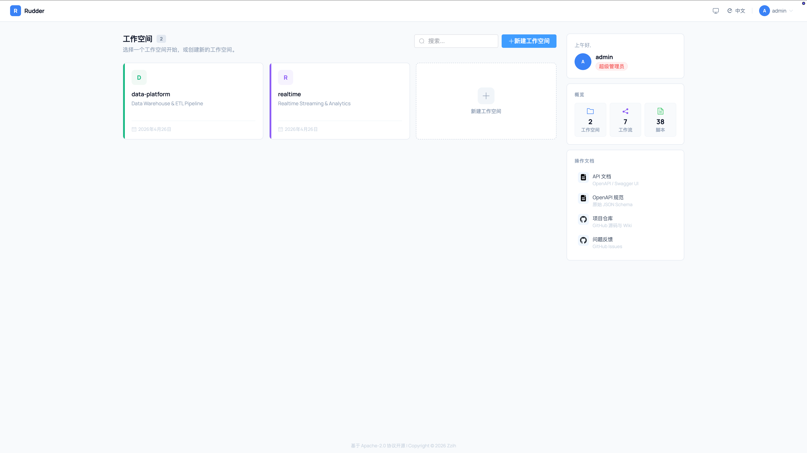
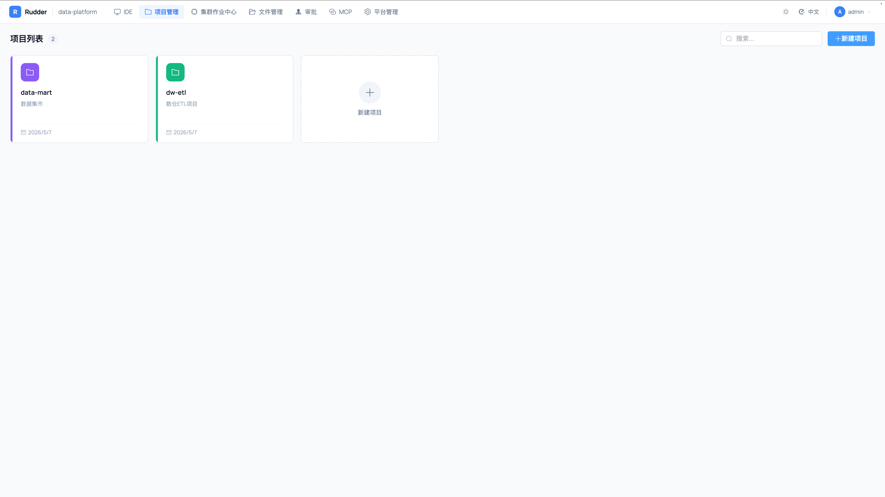
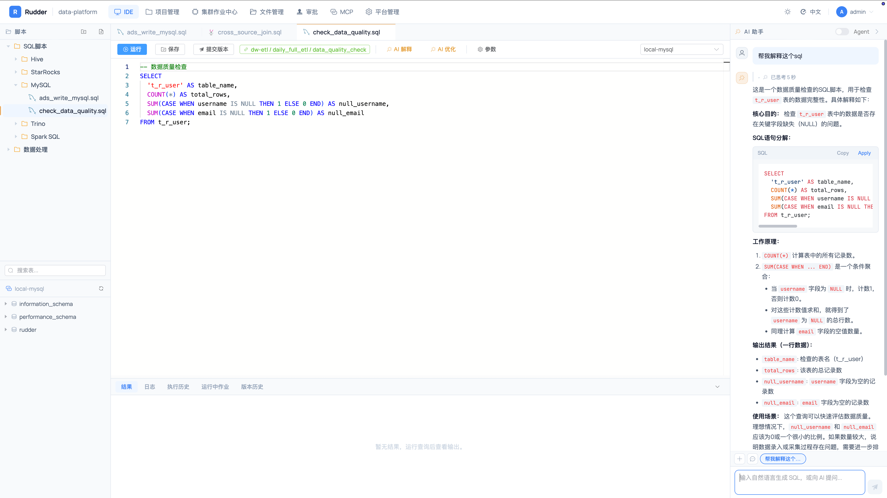
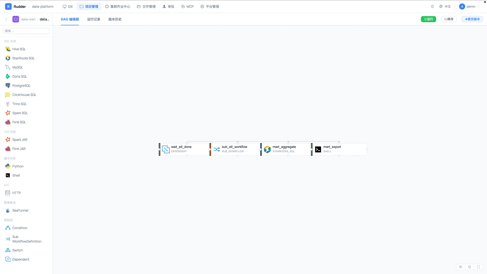
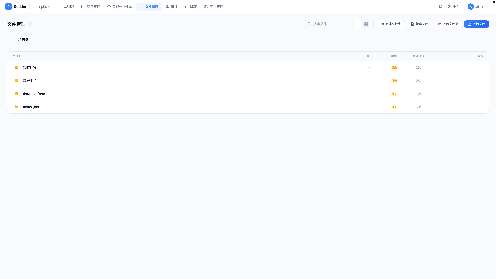
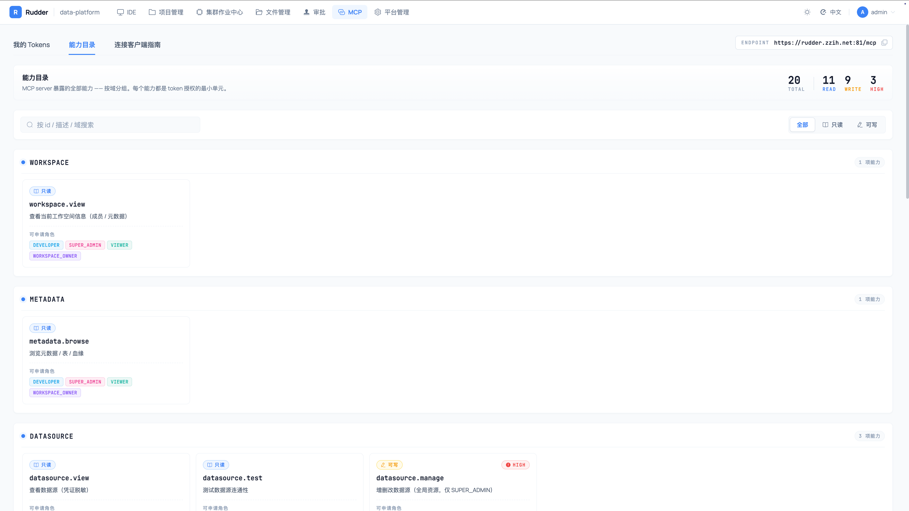
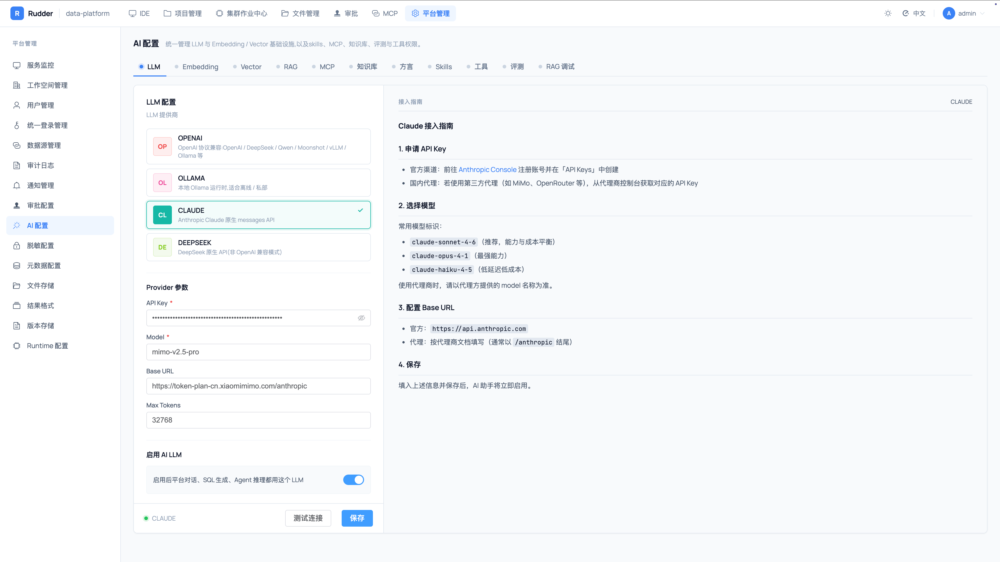
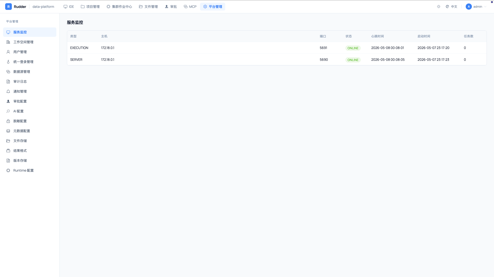
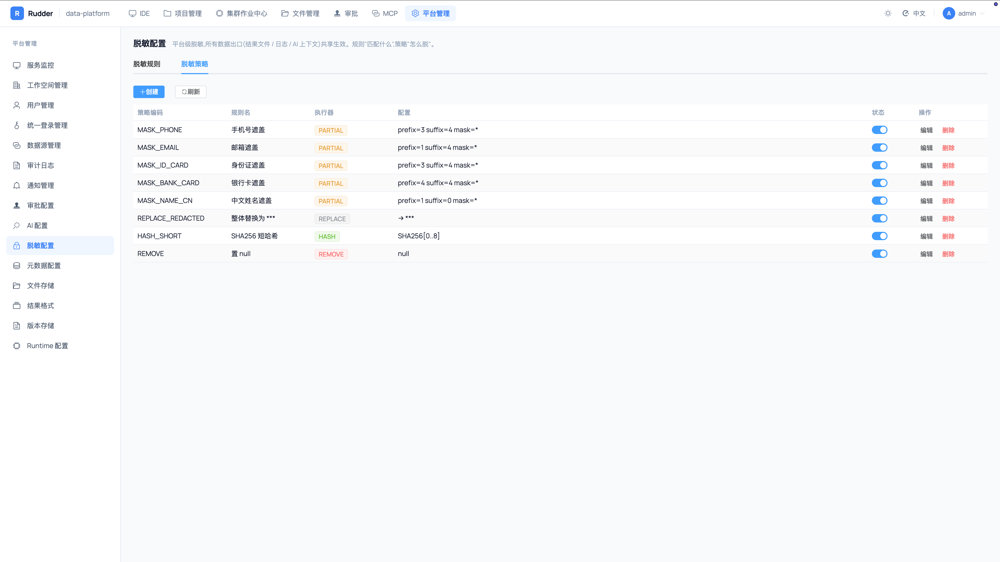
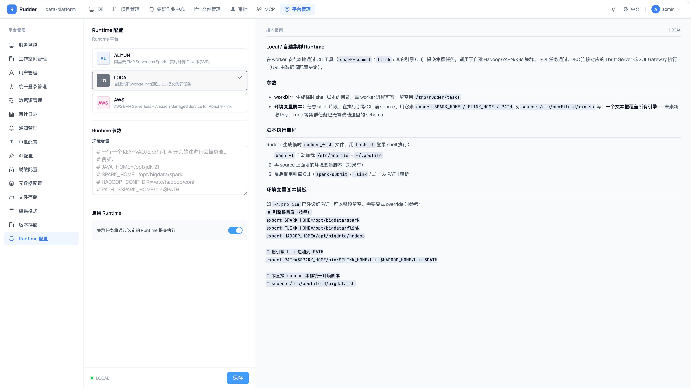

# Rudder

**AI-native unified batch + streaming data platform.**

*Take the helm of your data ocean.*

[](LICENSE)
[](https://openjdk.org/projects/jdk/21/)
[](https://spring.io/projects/spring-boot)
[](https://spring.io/projects/spring-ai)
[](https://vuejs.org/)

English | [中文](README.md)

---

Rudder is an **AI-first** batch + streaming data platform. The AI agent and MCP protocol are first-class platform citizens, woven through the IDE, metadata, datasource, permission, and audit layers. The data-development surface (online editing, DAG workflows, multi-engine execution) is extended through 11 SPI plug-in families, with first-class support for Hive / Spark / Flink / Trino / StarRocks / Doris / SeaTunnel, running on AWS, Aliyun, self-managed clusters, or Serverless runtimes.

**What sets Rudder apart**: most platforms bolt an AI assistant *on top of* a data platform. Rudder treats the AI agent and a two-way MCP channel as first principles — workspace capabilities (metadata, SQL execution, scripts, workflows) are reverse-exposed to any external AI IDE (Cursor / Claude Desktop / ...) through MCP, gated by PAT + capabilities + two-stage approval. The result: **workspace capabilities follow the user**.

## At a glance

```
┌──────────────────── Entry points ─────────────────────┐
│                                                                                │
│   Web IDE (Vue 3)         Cursor / Claude Desktop      curl / SDK              │
│   JWT / SSO               MCP protocol + PAT auth      REST API                │
│                                                                                │
└─────────────┬──────────────────┬───────────────────────┬──────────────────────┘
              │                  │                       │
              ▼                  ▼                       ▼
┌──────────────────────────── Server (rudder-api) ───────────────────────────────┐
│                                                                                │
│  REST + SSE          MCP Server (Spring AI)         AI Orchestrator             │
│  Permissions/Audit   19 Capabilities + PAT scope    Tool-calling loop           │
│  Redaction           2-stage approval (WRITE/HIGH)  3-Advisor pipeline          │
│                                                                                │
│  Workflow DAG + Cron + 4 control-flow nodes (CONDITION/SWITCH/SUB_WORKFLOW/DEPENDENT) │
│                                                                                │
└─────────────┬──────────────────────────────────────────────────┬───────────────┘
              │ RPC (Netty + auth-secret)                        │
              ▼                                                  │
┌─────────── Execution (rudder-execution) ───────────┐           │
│  TaskPipeline:                                     │           │
│  ResourceResolver → RuntimeInjector →              │  MySQL / Redis  ←─────────
│  JdbcResourceInjector → ResultCollector(redact)    │
└────────────────────────────────────────────────────┘
```

## Highlights

### AI Agent

- **Tool-calling agent** — Spring AI `internalToolExecutionEnabled=true`. The agent directly calls 22 built-in tools: script CRUD, read-only SQL, metadata browsing, table sampling, execution logs/results, RAG retrieval, etc.
- **Multi-turn streaming** — Session/Turn model, SSE streaming, separate channel for thinking/reasoning.
- **Cross-node stream cancellation** — Redis pub/sub + Reactor `Disposable` dispose; no thread-interrupt magic. Hit Esc and the stream is cut on whichever node is producing it.
- **Advisor pipeline** — `RedactionAdvisor` (input/output redaction) + `RudderRagAdvisor` (auto-RAG) + `UsageMetricsAdvisor` (token accounting).
- **Write-tool confirmation** — the agent emits a `ToolApproval` event before any write tool runs; the frontend pops a confirm dialog, only then does the call go through.
- **Skills + Pinned tables + Context profile** — workspace-scoped skill templates auto-surface as agent tools; pinned tables auto-inject into the system prompt; per-workspace RAG toggle / engine whitelist / model / token budget.
- **Budget and rate limiting** — provider routing, model-level rate limit, atomic Redis-backed token-budget deduction.
- **Multi-model** — Claude / OpenAI / DeepSeek / Ollama, route per scenario.
- **Feedback and offline eval** — like/dislike loop plus offline eval cases / runs, independent of the production path, nothing persists.

### MCP — both client and server

Rudder treats MCP (Model Context Protocol) as a **two-way citizen**: **as an MCP client** the agent can mount any external MCP server and merge its tools into Rudder's tool set; **as an MCP server** Rudder exposes its own endpoint so external AI IDEs (Cursor / Claude Desktop / VS Code MCP Inspector / ...) can connect directly and bring Rudder's workspace capabilities into the host IDE / assistant.

**MCP tool catalog** (8 domains):

| Domain | Sample tools |
|:---|:---|
| **workspace / project** | view / browse / author |
| **metadata** | browse / list catalogs / list tables / describe table |
| **datasource** | view / test / manage (SUPER_ADMIN only) |
| **script** | browse / search / get / create / update / delete / move / rename / dispatch |
| **execution** | view_status / view_result / run / cancel |
| **workflow** | browse / author / run / publish / instances / schedules |
| **approval** | view / act |

**Security model — three layers: capabilities + token + approval.** A PAT (`rdr_pat_xxx`, bcrypt cost=10) carries a subset of 19 capabilities and is checked by `ScopeChecker`'s twin gates (capability scope + the user's current workspace RBAC role). READ capabilities are granted at PAT creation; WRITE capabilities start in `PENDING_APPROVAL` and become active once the workspace owner approves the bundle; HIGH-sensitivity capabilities (`execution.run` / `datasource.manage` / `workflow.publish`) go through a two-stage approval (owner → SUPER_ADMIN). Every call passes through `McpToolGuardAspect`: Redis rate-limit (default 60 req/min) → audit (`t_r_audit_log` records user / token / tool / args / latency / verdict) → execute. `McpRoleChangeListener` revokes grants whenever a user is demoted.

### Knowledge base / RAG

- **Vector backends** — pgvector / Qdrant for semantic search; local MySQL FULLTEXT for zero-deploy keyword recall.
- **Platform-level metadata sync** — cross-workspace shared documents in five categories (SCHEMA / WIKI / METRIC_DEF / RUNBOOK / SCRIPT), pulled on a schedule into the vector store.
- **Engine compatibility filter** — RAG retrieval automatically filters by TaskType compatibility (a Hive query won't pull StarRocks docs).
- **MCP retrieval tool** — `search_documents` is exposed to the agent so it decides when to retrieve, in addition to the auto-injection mode driven by `RudderRagAdvisor`.

### Data development (batch + streaming)

- **Online IDE** — Monaco Editor for SQL / Python / Shell, instant execution and result preview.
- **Workflow orchestration** — AntV X6 visual DAG editor with four control-flow node types (CONDITION / SWITCH / SUB_WORKFLOW / DEPENDENT), plus built-in Cron scheduling.
- **Multi-engine** — Hive / StarRocks / Doris / ClickHouse / Trino / Spark / Flink / MySQL / PostgreSQL / Python / Shell / SeaTunnel / HTTP (13 task channels).
- **Unified batch + streaming** — Flink SQL / Flink JAR run natively in STREAMING mode and live alongside batch jobs in the same IDE.
- **Pluggable Runtime** — adapters shipped for self-managed clusters, Aliyun (Ververica + EMR Serverless), and AWS (EMR Serverless + Managed Flink).
- **Result formats** — JSON / CSV / Parquet / ORC / Avro export.

### Platform

- **Elastic architecture** — separate Server / Execution processes, in-house Netty RPC, horizontal scaling on both tiers; no ZooKeeper.
- **Metadata governance** — DataHub / OpenMetadata GraphQL with JDBC fallback; in-IDE table browsing.
- **Permissions + SSO** — four-level RBAC + per-workspace datasource scoping; OAuth2 / OIDC / LDAP for sign-in.
- **Publish approval** — Lark / Slack / KissFlow channels (SPI-extensible); project publishes and MCP token grants share the same approval engine.
- **Versioning + production scheduling** — script / workflow snapshots with diff, MySQL or Git (Gitea) backend; built-in Cron, plus a publish path into DolphinScheduler.
- **Data redaction** — global redaction pipeline; query results, datasource credentials, and log output all go through the same rules.
- **Audit + file backends + i18n** — full operation trace; local / HDFS / OSS / S3 file storage; backend i18n with five bundles + fully bilingual frontend.

## Tech stack

| Layer | Tech |
|:---|:-----|
| Backend | Java 21, Spring Boot 4.0.5, MyBatis-Plus 3.5.15, Spring AI 2.0.0-M6 |
| Frontend | Vue 3, TypeScript, Vite 6, Element Plus, Monaco Editor, AntV X6, Pinia |
| Transport | Custom Netty RPC framework with auth-secret verification |
| Persistence | MySQL 8.x (primary + service registry), Redis (stream-cancel pub/sub, rate limit, budget, cache) |
| Big data | Hive, StarRocks, Doris, ClickHouse, Trino, Spark, Flink, SeaTunnel, HDFS |
| Cloud | Aliyun (Ververica Flink + EMR Serverless Spark), AWS (EMR Serverless + Managed Flink) |
| AI | Claude / OpenAI / DeepSeek / Ollama; OpenAI / Zhipu Embedding; pgvector / Qdrant / local FULLTEXT |
| MCP | Rudder ships its own MCP server (Spring AI MCP) with PAT auth; also acts as an MCP client to mount external servers |
| Metadata | DataHub, OpenMetadata (GraphQL) + JDBC fallback |
| Approval / Notification | Lark OAPI, Slack API, DingTalk, KissFlow |

> **Hard dependencies: MySQL 8.x and Redis.** Both must be available — there is no degraded / fallback / memory-only mode (stream cancel pub/sub, rate limiting, budget deduction, and PAT cache invalidation strictly require Redis).

## Architecture

```
Server (rudder-api)                          Execution (rudder-execution)
  HTTP 5680 / RPC 5690                         HTTP 5681 / RPC 5691
├ REST API + frontend static (file:ui/)      ├ RPC receives task dispatch
├ JWT / SSO / RBAC                            ├ TaskPipeline
├ MCP Server endpoint + PAT auth              │  ├ ResourceResolver
├ AI Orchestrator + Tool Calling              │  ├ RuntimeInjector
├ Creates TaskInstance                         │  ├ JdbcResourceInjector
├ Workflow DAG + control-flow nodes            │  └ ResultCollector (with redaction)
│   (CONDITION / SWITCH /                     ├ Logs to local file + DB
│    SUB_WORKFLOW / DEPENDENT)                ├ Service registry (type=EXECUTION)
├ Dispatches tasks via RPC                     └ 10s heartbeat
├ Log/result query forwarding
├ Service registry (type=SERVER)
└ 10s heartbeat

           ↕ MySQL  (primary store, service registry, workflows, AI sessions, redaction rules, MCP tokens, audit, ...)
           ↕ Redis  (stream-cancel pub/sub, rate limit, budget, TokenViewCache, global cache)
```

## Module layout

```
rudder/
├── rudder-common                 Shared: Result, exceptions, ErrorCode enums, I18n, audit, stream registry, utilities
├── rudder-dao                    Entity / Mapper / DAO / enums (schema.sql: 43+ t_r_* tables)
├── rudder-rpc                    In-house RPC framework (Netty + auth-secret)
├── rudder-datasource             Datasource management, AES credential encryption, connection pool
├── rudder-spi/                   All pluggable extensions
├── rudder-service/
│   ├── rudder-service-shared         Shared by Server and Execution (script / task / workflow / metadata / approval / version / notification / i18n / redaction / stream registry ...)
│   ├── rudder-service-server         Server-only (publish, scheduling, SPI configuration, WorkflowInstanceRunner, ControlFlow Executors)
│   └── rudder-mcp                    MCP server: PAT auth, capabilities, tool guard, audit, role-change listener, client integration guides
├── rudder-ai                     AI capability suite
│   ├── orchestrator                  AiOrchestrator + AgentExecutor (AGENT) + TurnExecutor (CHAT)
│   ├── orchestrator/advisor          RedactionAdvisor / RudderRagAdvisor / UsageMetricsAdvisor
│   ├── orchestrator/tool             RudderToolCallback / ToolApprovalRegistry
│   ├── orchestrator/turn             TurnEvent stream (Token / Thinking / ToolCall / ToolApproval / Error / Meta)
│   ├── tool + tool/builtin           ToolRegistry + 22 built-in tools
│   ├── mcp                           McpClientManager (acts as MCP client to mount external servers)
│   ├── skill                         SkillRegistry / SkillToolProvider / SkillAgentTool
│   ├── rag                           DocumentIngestionService / DocumentRetrievalService
│   ├── knowledge                     EngineCompatibility / MetadataSyncService (platform-level shared docs)
│   ├── feedback + eval               FeedbackService + EvalService (offline path, never persists)
│   ├── context + permission          ContextProfileService + PinnedTableService + PermissionGate
│   └── dialect                       DialectService (DB override + classpath default)
├── rudder-bundles/               SPI provider dependency aggregations (api / execution)
├── rudder-api                    Server entry point (REST controllers + JWT, HTTP 5680 / RPC 5690)
├── rudder-execution              Worker entry point (TaskPipeline + log management, HTTP 5681 / RPC 5691)
├── rudder-arch-tests             ArchUnit guards for SPI layering rules
├── rudder-ui                     Vue 3 frontend (Vite 6 + Element Plus + Monaco + X6)
└── rudder-dist                   Tarball packaging + Server / Execution Dockerfiles
```

## SPI plug-in system

Rudder funnels every pluggable extension through a single `AbstractPluginRegistry<K, F>`. All SPI modules follow a strict `-api` / `-local` / `-<provider>` naming convention; adding a new engine or platform means implementing the corresponding factory interface plus one annotation.

| SPI type | Module | Providers | Notes |
|:---|:---|:---|:---|
| **Task** | `rudder-task` | mysql / postgres / hive / starrocks / doris / clickhouse / trino / spark / flink / python / shell / seatunnel / http | Task execution engines (13 + api) |
| **Runtime** | `rudder-runtime` | local / aliyun / aws | Execution-environment abstraction |
| **Metadata** | `rudder-metadata` | jdbc / datahub / openmetadata | Metadata providers |
| **LLM** | `rudder-llm` | claude / openai / deepseek / ollama | Large language models |
| **Embedding** | `rudder-embedding` | openai / zhipu | Text embeddings |
| **Vector** | `rudder-vector` | local / pgvector / qdrant | Vector store |
| **File** | `rudder-file` | local / hdfs / oss / s3 | File storage |
| **Approval** | `rudder-approval` | local / lark / kissflow | Publish approval |
| **Notification** | `rudder-notification` | lark / dingtalk / slack | Notification channels |
| **Version** | `rudder-version` | local / git | Version persistence |
| **Result** | `rudder-result` | json / csv / parquet / orc / avro | Result serialization (Java SPI + `@AutoService`) |

> Control-flow nodes (CONDITION / SWITCH / SUB_WORKFLOW / DEPENDENT) are not standalone TaskChannel SPIs. They live under `service.workflow.controlflow` on the Server and are executed in-process by `WorkflowInstanceRunner`, never dispatched to Execution.

Every provider ships with:
- A bilingual Markdown integration guide (`spi-guide/<type>-<provider>.{zh,en}.md`), bundled inside the provider jar.
- Frontend form-parameter declarations with i18n keys (`PluginParamDefinition`) — the Web UI auto-renders the configuration form.
- `validate(config)` and `testConnection(ctx, config)` hooks for pre-save validation and post-save smoke testing.

## Task types

| Category | TaskType | Datasource | Mode |
|:---------|:---------|:-----------|:------|
| SQL | HIVE_SQL / STARROCKS_SQL / MYSQL / DORIS_SQL / POSTGRES_SQL / CLICKHOUSE_SQL / TRINO_SQL / SPARK_SQL | HIVE / STARROCKS / MYSQL / DORIS / POSTGRES / CLICKHOUSE / TRINO / SPARK | BATCH |
| Streaming SQL | FLINK_SQL | FLINK | BATCH / **STREAMING** |
| JAR | SPARK_JAR | — | BATCH |
| Streaming JAR | FLINK_JAR | — | BATCH / **STREAMING** |
| Script | PYTHON / SHELL | — | BATCH |
| API | HTTP | — | BATCH |
| Data integration | SEATUNNEL | — | BATCH |
| Control flow | CONDITION / SWITCH / SUB_WORKFLOW / DEPENDENT | — | Server-side |

## Database

- Schema: [`rudder-dao/src/main/resources/sql/schema.sql`](rudder-dao/src/main/resources/sql/schema.sql) — 43+ `t_r_*` tables in total.
- Groups:
  - **Platform**: `workspace` / `workspace_member` / `project` / `user` / `audit_log`
  - **Resource development**: `script` / `script_dir` / `task_definition` / `task_instance` / `workflow_definition` / `workflow_instance` / `workflow_schedule`
  - **Datasource / metadata**: `datasource` / `datasource_permission` / `metadata_config`
  - **Publish / approval / version**: `publish_record` / `approval_config` / `approval_record` / `version_config` / `version_record`
  - **Service registry**: `service_registry`
  - **SPI configuration**: `provider_config` / `runtime_config` / `file_config` / `result_config` / `notification_config`
  - **Redaction**: `redaction_rule` / `redaction_strategy`
  - **AI**: `ai_config` / `ai_session` / `ai_message` / `ai_skill` / `ai_mcp_server` / `ai_tool_config` / `ai_pinned_table` / `ai_dialect` / `ai_context_profile` / `ai_metadata_sync_config` / `ai_document` / `ai_document_embedding` / `ai_feedback` / `ai_eval_case` / `ai_eval_run`
  - **MCP**: `mcp_pat` (bcrypt hash + prefix) / `mcp_token_scope_grant` (token × capability with `PENDING_APPROVAL` state)

## Quick start

> Rudder strictly requires **MySQL 8.x** and **Redis**. Execution engines (Hive / StarRocks / Trino / HDFS / Spark / Flink, etc.) are user-provisioned and connected through the datasource manager.

### Option 1: local development

```bash
git clone https://github.com/Zzih/rudder.git && cd rudder
cp .env.example .env                                  # configure MySQL / Redis / SSO / AI / RPC auth-secret etc.

./mvnw clean package -DskipTests                      # build the tarball
export $(grep -v '^#' .env | xargs)
bash rudder-dist/target/rudder-*-SNAPSHOT/api-server/bin/start.sh        # Server :5680/:5690
bash rudder-dist/target/rudder-*-SNAPSHOT/execution-server/bin/start.sh  # Execution :5681/:5691

cd rudder-ui && npm install && npm run dev            # frontend dev server
```

Open **http://localhost:5680**.

### Option 2: Docker images

```bash
./mvnw clean package -DskipTests   # produces rudder-dist/target/rudder-<v>-SNAPSHOT.tar.gz first

docker build -f rudder-dist/src/main/docker/api-server.dockerfile       -t rudder/api:dev .
docker build -f rudder-dist/src/main/docker/execution-server.dockerfile -t rudder/execution:dev .

docker run -d --name rudder-api       -p 5680:5680 -p 5690:5690 rudder/api:dev
docker run -d --name rudder-execution -p 5681:5681 -p 5691:5691 rudder/execution:dev
```

Images are based on `eclipse-temurin:21-jre`; entry scripts come from `rudder-dist/src/main/bin/`.

### Connect Cursor / Claude Desktop to Rudder

1. In the Web IDE → personal settings → **MCP Personal Access Token** → pick capabilities and create a token (WRITE-class capabilities require workspace owner approval before the token can use them).
2. Paste the resulting `rdr_pat_xxx` into the MCP config of Cursor or Claude Desktop:
   ```json
   {
     "mcpServers": {
       "rudder": {
         "url": "https://your-rudder-host/mcp",
         "headers": { "Authorization": "Bearer rdr_pat_xxx" }
       }
     }
   }
   ```
3. Restart the external IDE. You can now invoke Rudder workspace capabilities from inside Cursor or Claude Desktop — browse metadata, sample tables, run SQL, edit scripts, kick off workflows, all subject to capability scope, RBAC, audit, and rate limits.

Detailed step-by-step guides ship with the project: `rudder-service/rudder-mcp/src/main/resources/spi-guide/mcp-client-{cursor,claude-desktop,inspector}.{zh,en}.md`.

## Launch scripts

Unpacking `rudder-dist/target/rudder-<version>-SNAPSHOT.tar.gz` produces:

```
rudder-<version>/
├── bin/
│   ├── env.sh                Environment variables
│   ├── start-server.sh       Generic launcher
│   └── rudder-daemon.sh      Daemon mode
├── api-server/               Server bundle (bin / conf / libs)
└── execution-server/         Execution bundle (bin / conf / libs)
```

- **Foreground** (Docker entry point or `RUDDER_FOREGROUND=true`): `exec` replaces the shell with the java process.
- **Background**: `nohup` + PID file; logs land under `<server>/logs/`.

## Ports and environment variables

| Process | HTTP | RPC | Key env |
|:--------|:----:|:----:|:--------|
| Server (rudder-api) | `RUDDER_API_HTTP_PORT` (5680) | `RUDDER_API_RPC_PORT` (5690) | `RUDDER_REDIS_HOST/PORT/PASSWORD/DB`, `RUDDER_RPC_AUTH_SECRET` (≥32B), `RUDDER_SSO_*` |
| Execution (rudder-execution) | `RUDDER_EXECUTION_HTTP_PORT` (5681) | `RUDDER_EXECUTION_RPC_PORT` (5691) | (same) |

- MySQL / Redis use the standard Spring properties (`spring.datasource.*` / `spring.data.redis.*`).
- The RPC `auth-secret` must match between Server and Execution; otherwise connections are refused.
- Full env list: [`.env.example`](.env.example).

## Required services

| Service | Purpose | Required |
|:--------|:--------|:--------:|
| **MySQL 8.x** | Primary store + service registry + persistence | ✓ |
| **Redis** | Stream-cancel pub/sub, rate limit, budget deduction, TokenViewCache, distributed cache | ✓ |
| Hive / StarRocks / Doris / ClickHouse / Trino | Warehouse / OLAP / federated query | |
| Spark / Flink / SeaTunnel | Compute / data integration engines | |
| HDFS / OSS / S3 | Distributed storage | |
| DataHub / OpenMetadata | Metadata centre | |
| DolphinScheduler | Production scheduling (publish target) | |
| Vector store (pgvector / Qdrant) | Semantic recall for the RAG knowledge base | required when AI is enabled |

## Documentation

- Platform
  - [Quickstart](docs/quickstart.md)
  - [Configuration reference](docs/configuration.md)
  - [Deployment guide](docs/deployment.md)
  - [Architecture overview](docs/architecture.md)
- Features
  - [Workflows](docs/workflow.md)
  - [Task types](docs/task-types.md)
  - [Datasources](docs/datasource.md)
  - [Permission model](docs/permissions.md)
  - [DolphinScheduler integration](docs/dolphinscheduler.md)
  - [Notifications](docs/notification.md)
- Advanced
  - [SPI development guide](docs/spi-guide.md)
  - [RPC protocol](docs/rpc.md)
  - [Data redaction](docs/redaction.md)
  - [Runtime adapters](docs/runtime-adapters.md)
  - [Database schema](docs/database-schema.md)
- AI
  - [AI overview](docs/ai/README.md)
  - [Quickstart](docs/ai/quickstart.md)
  - [User guide](docs/ai/user-guide.md)
  - [Architecture](docs/ai/architecture.md)
  - [LLM / Embedding / Vector providers](docs/ai/providers.md)
  - [Skills and prompts](docs/ai/skills-prompts.md)
  - [Tools and MCP](docs/ai/tools-mcp.md)
  - [Knowledge base and RAG](docs/ai/knowledge-base.md)
  - [Offline eval](docs/ai/eval.md)
  - [Operations](docs/ai/operations.md)
  - [Troubleshooting](docs/ai/troubleshooting.md)
- Security
  - [Security overview](docs/security/README.md)
  - [JWT and login session](docs/security/jwt.md)
  - [SSO (OIDC + LDAP)](docs/security/sso.md)
  - [Audit log](docs/security/audit.md)
  - [Key rotation](docs/security/rotation.md)

## Screenshots

**Workspace home** — post-login landing: workspace grid + overview stats + configurable doc links



**Project view** — project list inside a workspace



**Web IDE** — online SQL / script editor with metadata completion and ad-hoc queries



**Workflow editor** — DAG editor on AntV X6 with 4 control-flow node types



**File manager** — unified entry over the file storage SPI (LOCAL / OSS / S3 / HDFS)



**MCP tokens** — PAT + Capability + two-level approval; connects Cursor / Claude Desktop



**AI configuration** — switch between LLM / Embedding / Vector / Rerank providers



**Platform admin** — one-stop admin: users, auth sources, datasources, audit, all SPI configs



**Redaction rules** — platform-level PII rules + strategies applied globally (query results / logs)



**Runtime config** — online config for LOCAL / Aliyun / AWS Runtime providers



## Acknowledgements

Rudder borrows heavily from the open-source community's hard-won lessons. Specifically:

- **[Apache DolphinScheduler](https://dolphinscheduler.apache.org/)** — Rudder's workflow model, task-type abstraction, the four control-flow node semantics (CONDITION / SWITCH / SUB_WORKFLOW / DEPENDENT), the `AbstractParameters`-style IN/OUT properties and varPool semantics, built-in scheduling parameters such as `BIZ_DATE`, the Server / Worker split with service registry, and the `WorkflowInstanceRunner` + `TaskInstance` lifecycle — all draw deeply on DolphinScheduler's mature design. Hats off to the DS community: their engineering investment in the scheduling space lets a tiny team stand on giant shoulders.
- **[Spring AI](https://spring.io/projects/spring-ai)** — `ChatClient`, the Advisor pipeline, the `ToolCallback` framework, and the Spring AI MCP server form the backbone of Rudder's AI module, so we can focus on business orchestration and the capability security model rather than protocol plumbing.
- **[DataHub](https://datahubproject.io/) / [OpenMetadata](https://open-metadata.org/)** — mature metadata governance and PII classification models. Rudder's `MetadataProvider` SPI mirrors their field design, so it plugs straight into either system.

And every other open-source project Rudder builds on — Spring Boot, Vue, Element Plus, Monaco Editor, AntV X6, MyBatis-Plus, Netty, Reactor, Quartz, Anthropic MCP, pgvector, Qdrant, and many more. Without those communities' sustained investment, a one-person project like Rudder simply could not exist. See [`pom.xml`](pom.xml) and [`rudder-ui/package.json`](rudder-ui/package.json) for the full dependency list.

## Project background

> The notes below are the author's personal write-up. Skip them if you only need the technical bits above.

I have spent eight years working in data engineering, six or seven of them on big-data platforms — hand-rolling Hadoop clusters, migrating between cloud vendors, integrating one scheduling system after another. That accumulated mileage gradually crystallized into a clearer picture of what a *good* data platform should feel like.

The project sprouted from an idea five or six years ago: build a genuinely usable open-source big-data IDE. But one person's bandwidth is finite — even with a clean backend architecture, frontend pieces such as the IDE editor, the DAG editor, and the workflow visualization were always the bottleneck, so the idea sat on the shelf.

Today, AI-assisted programming is mature enough to lift exactly that bottleneck — especially on the frontend, where complex component interactions and UI polish can be co-piloted efficiently. That makes a one-person full-stack project finally feasible. So I stopped waiting and put years of accumulated thinking into practice.

### The awkward middle ground for data teams

Big-data teams sit in an oddly fractured spot inside companies. Small companies can't afford the cost (and rarely need it). Top-tier giants can afford it but already have their own cloud products (DataWorks, EasyData, etc.). The genuine pain lives in the middle — companies large enough to have a data team but small enough to feel every cost decision. They face three traps:

- **Cloud platforms don't fit** — DataWorks / EasyData and friends collide with the company's own business processes, permission models, and approval pipelines; the secondary-development cost ends up rivalling building from scratch.
- **Open-source projects are bloated** — DataSphere Studio and similar projects are feature-complete but heavyweight: too many modules, too many concepts, painful to deploy and operate, and you carry features you'll never use.
- **In-house builds drag** — building a platform from zero (scheduling, workflow engine, multi-engine adapters, IDE editor, DAG visualization, permission UI) is hard for a small team to ship in a sane time frame.

What's missing isn't yet another grand all-in-one platform; it's a **lightweight, modern, easy-to-extend** data IDE — useful out of the box, plug-in-extensible at the edges, and free of features you didn't ask for.

### The pain of constant tech migrations

Looking back at the last several years of platform churn:

1. Buy cloud VMs, hand-roll Hadoop / YARN clusters.
2. Drop self-managed clusters for cloud-managed EMR.
3. Migrate between cloud vendors for cost / compliance / commercial reasons.
4. Push toward Serverless to keep ops cost down.

Each migration drags the data platform with it: features get rewritten, code grows fragmented, technical debt piles up. What we really need is a platform that can adapt to *any* cloud — which is why Rudder abstracts the execution environment as a **Runtime SPI**: whether the cluster runs on AWS EMR, Aliyun Dataproc, or Serverless Spark, you only swap the Runtime adapter; scheduling, workflows, and the IDE itself stay untouched.

### Unified batch and streaming

Traditional data platforms split batch and streaming into two systems, two dev models, two ops practices. Rudder unifies them through a single TaskChannel SPI from day one: batch jobs (Hive / Spark / SQL / Python / Shell / SeaTunnel) flow through DAG workflows + Cron schedules; streaming jobs (Flink SQL / Flink JAR) author and submit in the same IDE under a separate lifecycle. Developers do everything in one place instead of context-switching between systems.

### AI-native + MCP-native, both ways

AI is a **first-class platform feature** in Rudder, not a bolt-on plug-in. Tool-calling agents, skills, RAG, feedback loops, offline evals — woven into the IDE, metadata, datasource, permission, and audit layers. The three core AI primitives (LLM, Embedding, Vector Store) are independent SPIs, free to mix Claude / OpenAI / DeepSeek / Ollama / Zhipu / pgvector / Qdrant.

Going further, MCP is a **two-way citizen**: Rudder is both an MCP client (mounting external servers' tools into its agent) and an MCP server (exposing workspace capabilities to Cursor, Claude Desktop, MCP Inspector, and any future MCP-aware IDE). With the three-layer security model — PAT + capability scope + approval — workspace capabilities follow the user. You can drive Rudder from inside Cursor: ask Claude to browse your warehouse metadata, sample tables, edit scripts, and trigger workflows, with every call audited end-to-end, every output redacted, and every sensitive operation routed through two-stage approval.

### About the name

Rudder. The thing that lets you steer. Hopefully it lets every user steer freely through their own data ocean.

## Contributing

Issues and pull requests are welcome. See [CONTRIBUTING.en.md](CONTRIBUTING.en.md) for the full workflow (build, code style, commit convention, PR target branch).

> The primary branch is `dev`. Open all PRs against `dev`.

## Contact

- GitHub Issues: [https://github.com/Zzih/rudder/issues](https://github.com/Zzih/rudder/issues)

## License

[Apache License 2.0](LICENSE)
